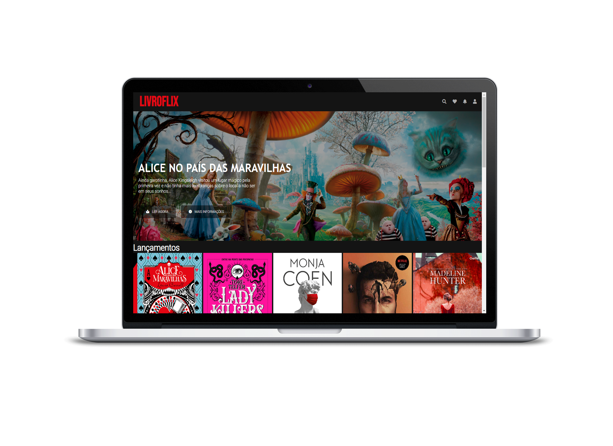

<h3 align="center">
    <a href="https://livroflix.vercel.app/">
        
        <b><h1>Livroflix :books: :heart: </h1></b></a>     

## :books:	Livroflix: Sua netflix de livros.
<p> Já imaginou uma netflix só de livros ? pois é :open_book: :heart: . </p>

## :desktop_computer:	 Tecnologias Utilizadas

- [HTML](https://html.com/)
- [CSS](https://purecss.io/)
- [JavaScript](https://www.javascript.com/)
- [jQuery](https://owlcarousel2.github.io/OwlCarousel2/)

## :rocket: Clone

```sh
  $ gh repo clone NaiaraBorges/Livroflix
```

## :purple_heart: :boom: screenshot


